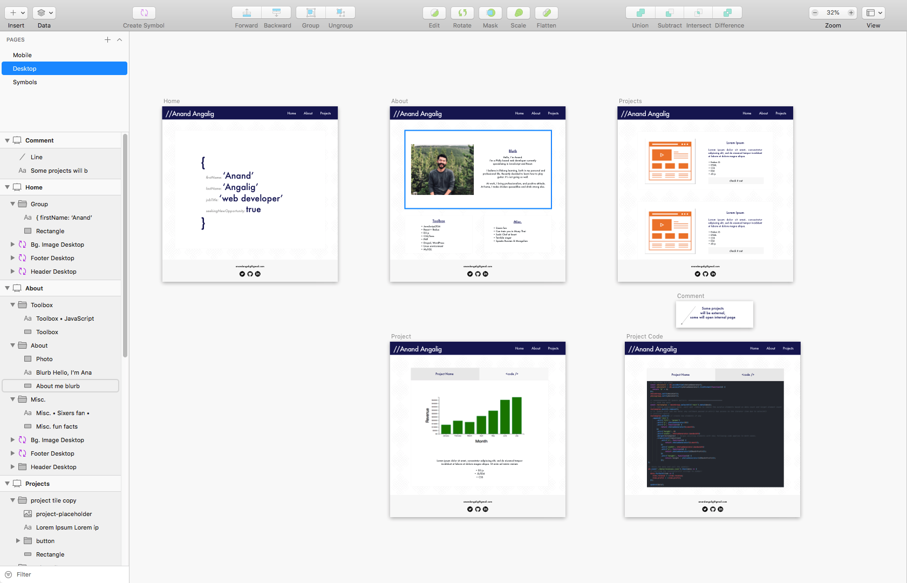
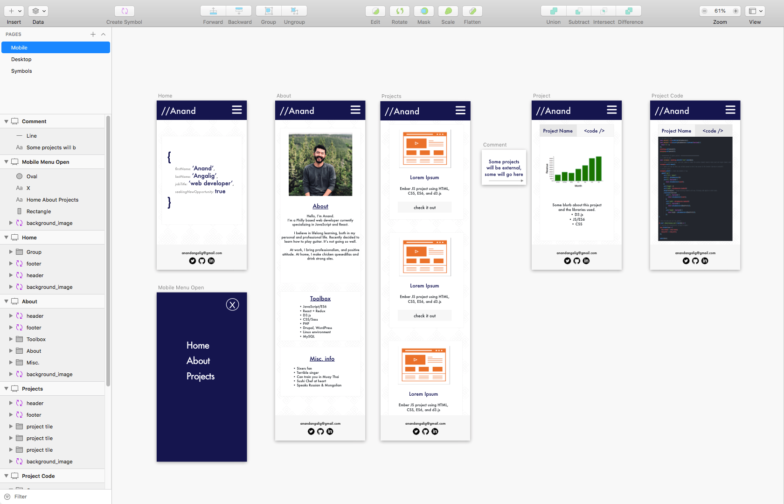

# _Anand Angalig's portfolio site_

## Description

_My personal portfolio site - rebuilt using React and ES6_

_Hosted on Netlify: https://anandangalig.com_

## To spin it up locally

- _Clone this repo_
- _Navigate to root directory_
- _run "npm install" command to install dependencies_
- _run "npm start" command to this app in development mode_
- _open http://localhost:3000 to view it in the browser._

## Technologies Used

- _React_
- _React Hooks_
- _React Router_
- _Axios_
- _JavaScript/ES6_
- _HTML,CSS_
- _CSS Grid_
- _Sketch_

## Design Process in Sketch

## License

Copyright (c) 2019 Anand Angalig. All rights reserved.
